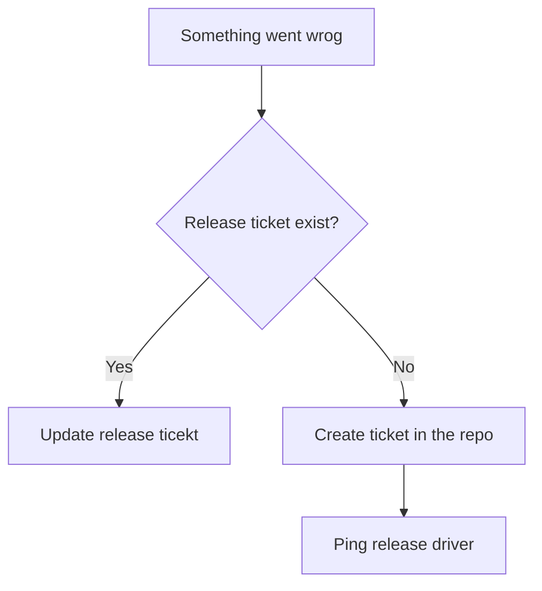

# Proof of concept - Release management via Release tickets

## Brief info
This repo contains workflow that represents workflow with release tickets. The main idea of this approach is that we can manage the release process for several repos in one place.

### Related resources

The [release-process-demo-target-1](https://github.com/alexander-smolyakov/release-process-demo-target-1) contains workflow that can be triggered from this repository. The related flow will send updates to the release ticket. 

## How does it work?
Briefly speaking repositories are communicating with each other via events. These events are triggered workflows to send/receive data.

The implementation can be found in `release_flow.yml`.

## Implementation details

Under the hood, we are using GitHub API and the `github-script` action. This action allows us to execute various API queries to different GitHub endpoints. Another benefit of using this action is that we can use data from the request's response and use this data on the next steps of our workflow.

### Example

https://github.com/alexander-smolyakov/release-process-demo/blob/e2e0732414be8ec2fa4b3fd9e1b34e183b816066/.github/workflows/release_flow.yml#L56-L73

## Constraints and limitations

Currently, there are the following constraints and limitations:

- All events that could be triggered are living in the scope of the repo itself. That's why we use API calls;
- The secrets rotation. To call API we need an API token. We need to add this token to all repos to be able to call each other workflows. It could be painful to update it in all repos, so need to investigate how to better handle it;
- There is no possibility to dynamically render inputs for workflow. This means that we will have to implement specifications for workflows that are required some specific info.
- There is an inconsistency in the event processing queue. This may cause some updates to be processed out of the order in which they were submitted.

## Notification strategy

Since our release management system will be distributed, we need to think about how we can notify the release driver in case something went wrong. My suggestion is to use the following strategy:

> If there is a release ticket we send notification to it, otherwise we will create a separate ticket in repo where the issue appeared.

## Points of improvements

Since this implementation is just proof-of-concept there is room for improvement:
- Use data from contexts objects instead of using hardcoded data;
- Extract steps to reusable workflows to avoid code duplications;
- Improve inline scripts to provide more data for debugging;
- Provide the ability to choose between creating a new comment per notification or updating the existing one.
